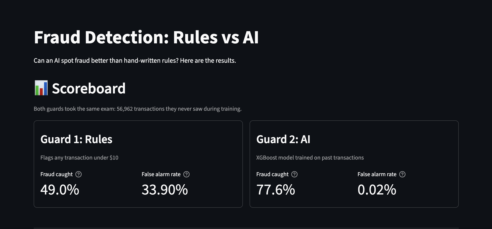
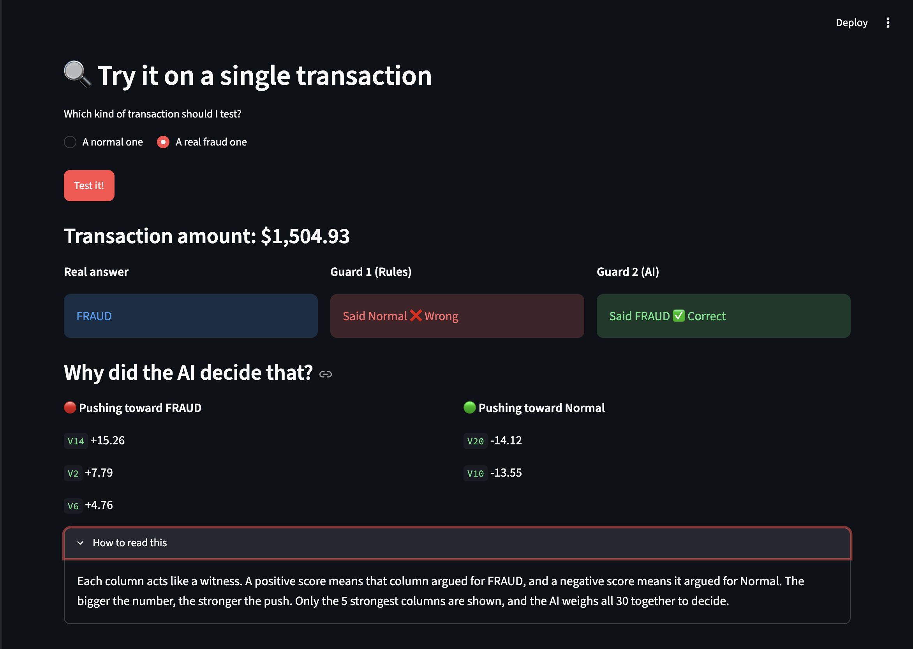

# Fraud Detection: Rules vs AI

A comparison of a hand-written rule and a machine learning model for detecting credit card fraud, with explanations for each AI prediction and an interactive Streamlit app.

## Results

Both approaches were tested on the same 56,962 held-out transactions (20% of the data, never seen during training).

| Approach | Fraud caught | Innocent transactions wrongly flagged |
|---|---|---|
| Rule-based (flag amounts under $10) | 49.0% | 33.90% |
| XGBoost model | 77.6% | 0.02% |



## The problem

Only 0.17% of the 284,807 transactions are fraud (492 cases). A model that always answered "normal" would be about 99.8% accurate and catch no fraud, so accuracy is misleading here. I evaluated two measures instead:

- **Catch rate:** of all real fraud, how much was found
- **False alarm rate:** of all innocent transactions, how many were wrongly flagged

## How it works

1. **Explore the data** (`explore.py`): size, fraud count, and how fraud differs from normal transactions.
2. **Rule-based approach** (`rule_based_guard.py`): flags any transaction under $10, based on the finding that fraud amounts tend to be smaller.
3. **ML approach** (`ai_guard.py`): an 80/20 train/test split, then an XGBoost classifier trained on the 80%.
4. **Explanations**: SHAP shows which columns pushed each prediction toward fraud or toward normal.
5. **Interactive app** (`app.py`): a Streamlit page with the scoreboard, a button that tests both approaches on a random transaction, and the SHAP explanation.



## Tech stack

Python, pandas, scikit-learn, XGBoost, SHAP, Streamlit

## Run it yourself

1. Download `creditcard.csv` from the [Kaggle Credit Card Fraud Detection dataset](https://www.kaggle.com/datasets/mlg-ulb/creditcardfraud) and place it in the project folder. It is not included here because of its size.
2. Install the requirements:

```
pip install -r requirements.txt
```

3. Run the app:

```
python3 -m streamlit run app.py
```

On Mac, XGBoost may need OpenMP: `brew install libomp`.

## Limitations

- **Anonymized features:** columns V1 to V28 come from the dataset provider's PCA transformation, so SHAP shows which columns mattered but not what they mean in real life.
- **Simple baseline:** the rule uses one condition. A real rules engine would combine many, so the gap shown here is against a deliberately simple baseline.
- **Few fraud cases in the test set:** the test set contains only 98 frauds, so the exact catch rate would shift with a different split.
- **No tuning:** XGBoost ran with default settings, with no threshold tuning or explicit handling of class imbalance.
- **Single dataset:** results come from two days of European card transactions from 2013 and may not carry over to other data.

## Possible next steps

Tune the decision threshold, handle class imbalance explicitly (for example with class weights), compare other models, build a stronger rule baseline, and test on a different time period.